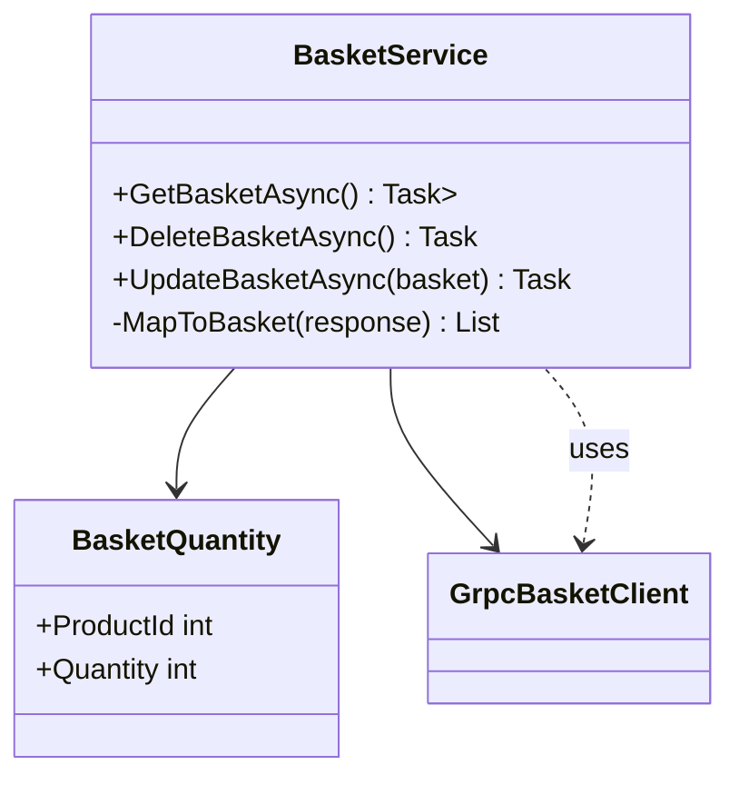

# BasketService

Der `BasketService` ist eine Service-Klasse im eShop-Frontend, die die Kommunikation mit dem Warenkorb-Backend über gRPC kapselt. Sie bietet Methoden zum Abrufen, Aktualisieren und Löschen des Warenkorbs eines Nutzers.

## Funktionen

- **GetBasketAsync**: Holt den aktuellen Warenkorb des Nutzers.
- **DeleteBasketAsync**: Löscht den Warenkorb des Nutzers.
- **UpdateBasketAsync**: Aktualisiert den Warenkorb mit neuen Mengen.
- **MapToBasket**: Hilfsmethode zur Umwandlung der gRPC-Antwort in lokale Objekte.

## Architektur



## Beispielaufruf

```csharp
var basketService = new BasketService(grpcClient);
var basket = await basketService.GetBasketAsync();
await basketService.UpdateBasketAsync(basket);
await basketService.DeleteBasketAsync();
```

---

Die Klasse hält sich an die Trennung von Service- und Transportlogik und verwendet asynchrone Methoden für alle I/O-Operationen.
